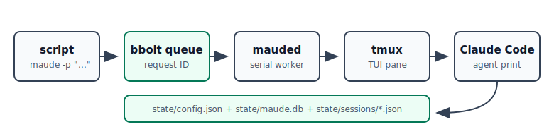

# maude

`maude` is a tiny `claude -p` compatibility shim for scripts, cronjobs, and shell pipelines.

Instead of starting Claude Code in deprecated print mode, `maude -p` queues the request for a small local daemon. The daemon keeps a normal Claude Code TUI alive in tmux, pastes an envelope into that pane, and tells the agent to complete the request with `maude agent print`. The goal is a one-letter migration path for common automation: change `claude -p` to `maude -p`.



## Installation

### Homebrew (macOS/Linux)

```sh
brew tap dorkitude/maude
brew install maude
```

### From Source

```sh
git clone https://github.com/dorkitude/maude.git
cd maude
make build
make install
```

### For Development

```sh
git clone https://github.com/dorkitude/maude.git
cd maude
go run ./cmd/maude --help
make test
```

## Usage

Send a prompt to the default persistent Claude TUI:

```sh
maude -p "summarize this repository"
```

Pipe input the same way scripts commonly used `claude -p`:

```sh
git diff | maude -p "review this diff"
```

Route work to a named Maude/tmux session:

```sh
maude -p --session nightly "run the nightly maintenance checklist"
```

Switch the underlying Claude conversation in that pane:

```sh
maude -p --session nightly --resume 018f... "continue from this Claude session"
```

Inspect, attach, or reset the tmux-backed session:

```sh
maude status
maude attach --session nightly
maude reset --session nightly
```

`maude` stores its JSON config in `state/config.json` by default and session metadata in `state/sessions/`. The `state/` directory is gitignored.

## Daemon Model

`maude -p` is a short-lived client. It writes a request into `state/maude.db`, starts the daemon if needed, waits for its request ID, and prints the response.

`maude daemon run` is the long-running worker. It is the only process that talks to tmux, so concurrent cronjobs and shell scripts do not race over the same Claude Code pane.

Claude receives an envelope that includes a command like:

```sh
maude agent print --request <id>
```

When Claude pipes its final answer to that command, the waiting `maude -p` process receives the matching output.

## Notes

Claude Code's TUI is not a machine-output protocol, so Maude avoids scrollback scraping for normal print responses. The TUI runtime sends the response back through `maude agent print`, which is much less fragile and lets multiple callers share the same long-running Claude Code session safely.
